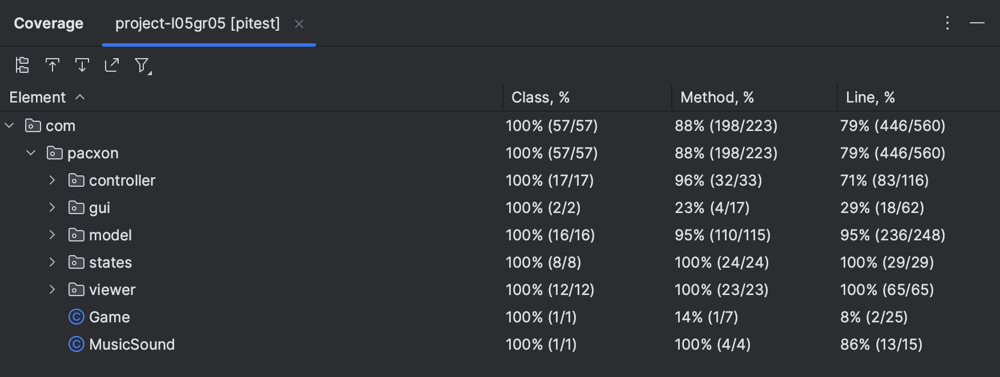
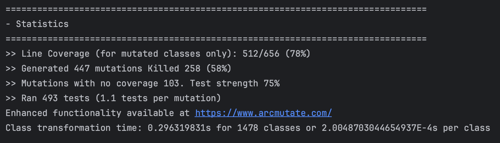

## LDTS_T05G05 - PACXON

O "Pacxon" consiste na junção de dois jogos: PacMan e Xonix. O objetivo principal do jogo é preencher os espaços vazios e capturar os monstros construindo paredes à volta deles. O utilizador passa para o nível seguinte assim que preencher 80% do mapa. À medida que avança de nível a dificuldade aumenta.

Autores: Beatriz Pereira (up202207380), Francisca Fernandes (up202106509) e Francisco Lopes (up202108796) para LDTS 2023/24

### IMPLEMENTED FEATURES

- Menu: Oferece as funcionalidades de iniciar o jogo, ver como jogar, ver as regras e sair;
- Movimento do PacMan: O utilizador consegue movimentar o PacMan através das teclas convencionais do seu computador;
- Movimento dos Monstros: Os Monstros movimentam-se automaticamente, de forma aleatória;
- Colisão entre o PacMan e os Monstros: Quando o PacMan e os Monstros colidem, o PacMan perde uma vida e tem de recomeçar o nível em que se encontra. Caso seja a sua última vida, perde o jogo;
- Preenchimento dos blocos: O caminho que o PacMan percorre vai preenchendo os blocos do mapa desde que não colida com nenhum monstro.
- Música de fundo;

### Implementações

#### Estrutura Geral
###### Problemas e objetivos
Para além de desenvolver um jogo adequado e funcional, um dos principais objetivos do grupo foi conseguir aplicar os conhecimentos que foram sendo adquiridos ao longo do semestre, isto é, a correta aplicação de design patterns e a implementação de testes apropriados.

###### Design Patterns
No desenvolvimento do jogo Pacxon, optou-se por uma abordagem de arquitetura de software estruturada e modular, implementando-se o padrão arquitetural Model-View-Controller (MVC) e o padrão de design State Pattern. Estas escolhas revelaram-se cruciais para assegurar a escalabilidade, a manutenção e a clareza do código.
###### Model-View-Controller (MVC):
Consiste num padrão arquitetural que separa a lógica da aplicação em três componentes interligados, mas distintos. Esta separação ajuda a gerir a complexidade e facilita a manutenção do código. Assim se dá interação entre os dados do jogo (Model), a interface com o utilizador (View) e a lógica de controlo (Controller).
Estruturamos o projeto de modo a "responsabilizar" o model pela camada de dados e lógica do jogo. Deste modo, inclui os movimentos das personagens, pontuação e estado do jogo.
Já View é responsável pela representação visual e a interface do utilizador. A View lida com a apresentação dos elementos gráficos do jogo, como personagens, obstáculos e menus. É responsável por exibir as informações de forma a que o jogador possa interagir eficazmente com o jogo.
Por fim, o Controller atua como intermediário entre o Model e a View. O Controller responde a eventos de entrada do jogador (como movimentos do teclado), processa essas entradas e faz alterações no Model ou atualiza a View. Isto inclui mudar a posição das personagens, iniciar ou pausar o jogo, e responder a interações nos menus, entre outras funções.

###### State Pattern:
O State Pattern é um padrão de design que permite a um objeto alterar o seu comportamento, quando o seu estado interno muda. No contexto do Pacxon, implementou-se o State Pattern para gerir os diferentes estados do jogo, como o menu principal, o jogo em curso, a tela de pausa e a tela de conclusão do jogo.
Cada estado é encapsulado na sua própria classe, derivada de uma classe abstrata ou interface de estado. Isto permite que o jogo mude de um estado para outro de forma fluida, sem que exista uma lógica condicional complexa.
O State Pattern proporciona uma estrutura clara para a transição entre diferentes fases ou modos do jogo, facilitando a expansão ou modificação dos estados do jogo.

Em suma, a combinação destes padrões no desenvolvimento do Pacxon contribuiu significativamente para a criação de um código mais organizado, flexível e fácil de manter, permitindo uma separação clara das responsabilidades, o que facilitou a depuração e as expansões ou modificações necessárias ao longo do desenvolvimento do jogo.

###### Singleton pattern
Este padrão foi utilizado para garantir que certas componentes do jogo existiam apenas numa instância durante toda a execução do jogo.
Desta forma, recorreu-se, nomeadamente, a este padrão para a implementação de música no jogo.
A classe MusicSound assegura que o mesmo controlo de áudio é acessível em todo o jogo, evitando a reprodução sobreposta da música ou a criação desnecessária de múltiplas instâncias de controlo de áudio.

###### Observer pattern
O padrão Observer é utilizado para implementar a comunicação entre diferentes componentes do jogo de forma que quando um evento ocorre ou o estado de um objeto muda, outros objetos interessados são automaticamente notificados e atualizados.
Por exemplo, se a pontuação do jogador ou o número de vidas mudar, a interface do usuário precisa deser atualizada para refletir essas mudanças. Aqui, a pontuação e as vidas podem ser consideradas como "sujeitos", enquanto a interface do usuário atua como "observador". Sempre que o estado dos sujeitos muda, os observadores são notificados para atualizar a exibição.

###### Strategy pattern
Este padrão permite a troca dinâmica de algoritmos ou comportamentos em tempo de execução.
No nosso projeto, foi utilizado para alterar o comportamento dos personagens e elementos do jogo.
Assim, permitiu-nos alterar dinamicamente o comportamento dos inimigos sem alterar o código que os utiliza, nomeadamente ao associar o movimento dos monstros enquanto um movimento aleatório.

###### Factory Method pattern
O padrão Factory Method é utilizado para criar objetos sem especificar a classe exata do objeto que será criado. Assim, forma criados diferentes tipos de objetos em tempo de execução, como inimigos, moedas ("boosts" para a pontuação) ou níveis.

###### Command pattern
O padrão Command encapsula uma solicitação como um objeto, permitindo parametrizar clientes com diferentes solicitações e enfileirar solicitações. Este padrão foi usado para mapear ações do jogador a comandos específicos.
Tal como é possível ver no nosso menu, determinadas teclas foram associadas a um comando específico. Por exemplo, a tecla de seta para cima foi mapeada para um comando que move o Pacman para cima. Isso separa a lógica de deteção de entrada do teclado da lógica de movimentação do personagem, tornando o código mais modular e fácil de alterar ou expandir.

### Code-Smells
O grupo tentou, sempre que possível, evitar implementações que se pudessem tornar em eventuais problemas - code smells.
O projeto não apresenta erros evidentes e não foram encontrados code-smells.
No entanto, na submissão anterior, encontramos alguns code smells como Speculative Generality (Generalidade Especulativa), isto é, código que fora criado para lidar com futuras funcionalidades, mas que acabou por não ser necessário ou ter necessitado de várias alterações.

### Testing
O grupo recorreu a algumas ferramentas e Frameworks para a tarefa de testing, tais como:
JUnit: Para a criação e execução de testes unitários.
Mockito: Para a criação de mocks e simulação de comportamentos.
PIT Mutation Testing: Para avaliar a qualidade dos testes unitários, identificando deficiências através de mutações no código.

Foram utilizados testes unitários e foi, ainda, implementada a estratégia/padrão de teste de Mocking, bem como a de Property-Based Testing (ainda que implementada em menor quantidade).

Por fim, obteve-se um conjunto de testes eficazes e um resultado de coverage bastante satisfatório.

#### Coverage

**Fig 1.** Coverage dos testes implementados

**Fig 2.** Estatística 
#### Link to testing report
[Testing Report](../build/reports/tests/test/index.html)

### SELF-EVALUATION

- Beatriz Pereira: 33%
- Francisca Fernandes: 33%
- Francisco Lopes: 33%
