## LDTS_T05G05 - PACXON

O "Pacxon" consiste na junção de dois jogos: PacMan e Xonix. O objetivo principal do jogo é preencher os espaços vazios e capturar os monstros construindo paredes à volta deles. O utilizador passa para o nível seguinte assim que preencher 80% do mapa. À medida que avança de nível a dificuldade aumenta.

Autores: Beatriz Pereira (up202207380), Francisca Fernandes (up202106509) e Francisco Lopes (up202108796) para LDTS 2023/24

### UML

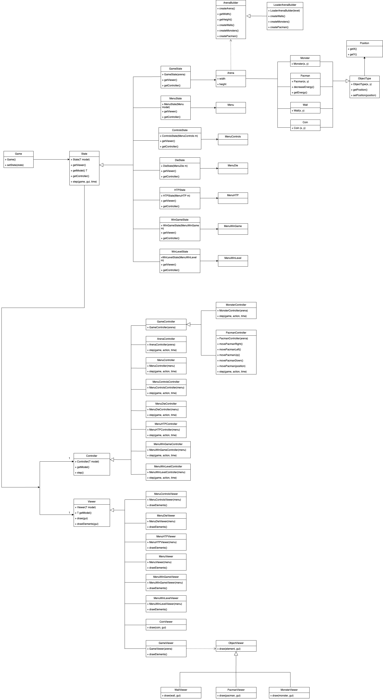
**Fig 1.** Modelo UML do Projeto

### MOCKUPS 

Os seguintes mockups foram desenvolvidos recorrendo à plataforma "Figma" e têm como objetivo esboçar o resultado do design final pretendido pelo grupo.
Inicialmente pensámos que poderíamos utilizar ficheiros com a extensão .png no projeto então tínhamos idealizado estes mockups. Depois de reler o script, vimos que tinha que ser tudo em texto então o resultado final ficou evidentemente diferente dos mockups.

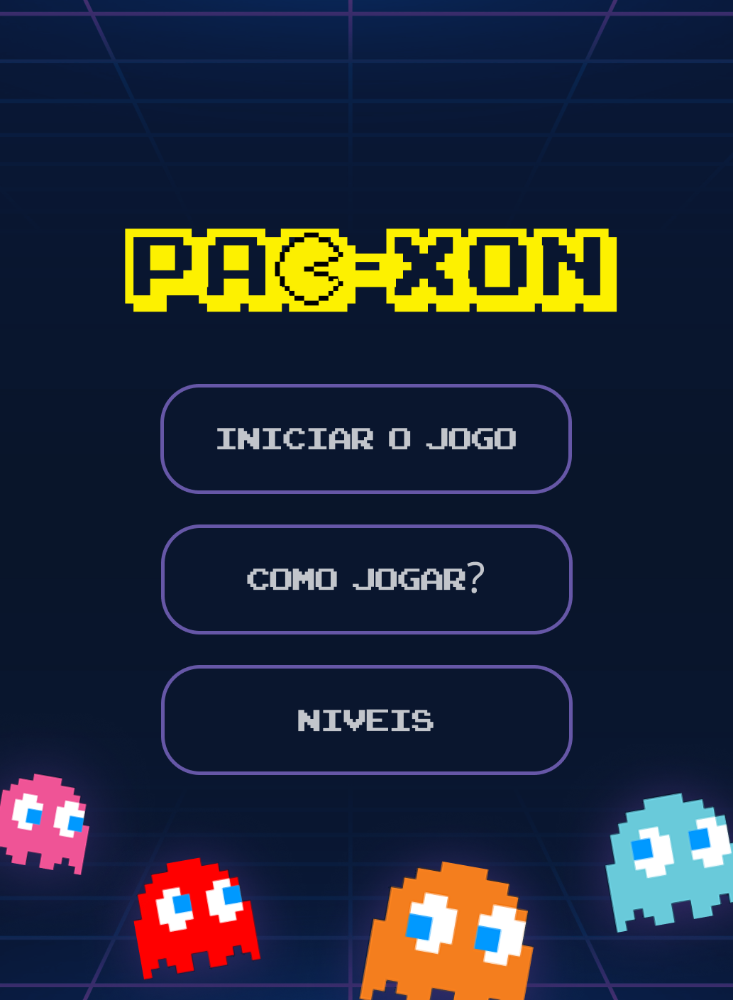 
**Fig 2.** Menu Inicial 

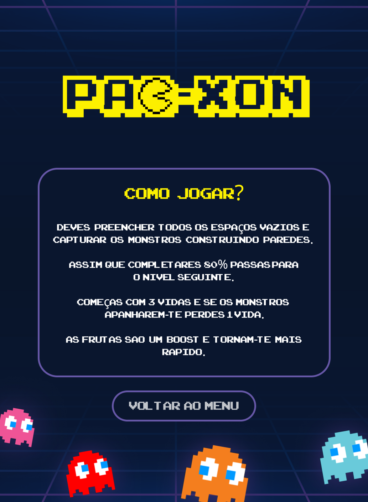
**Fig 3.** Como Jogar

  
**Fig 4.** Menu Níveis

 
**Fig 5.** Nível 1

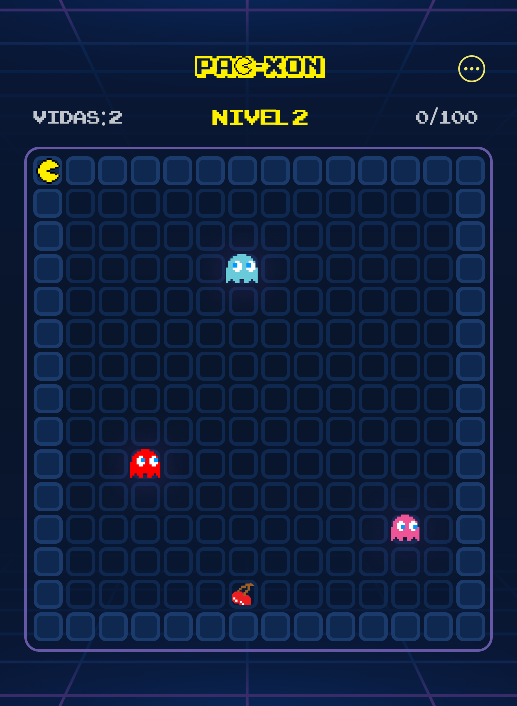
**Fig 6.** Nível 2

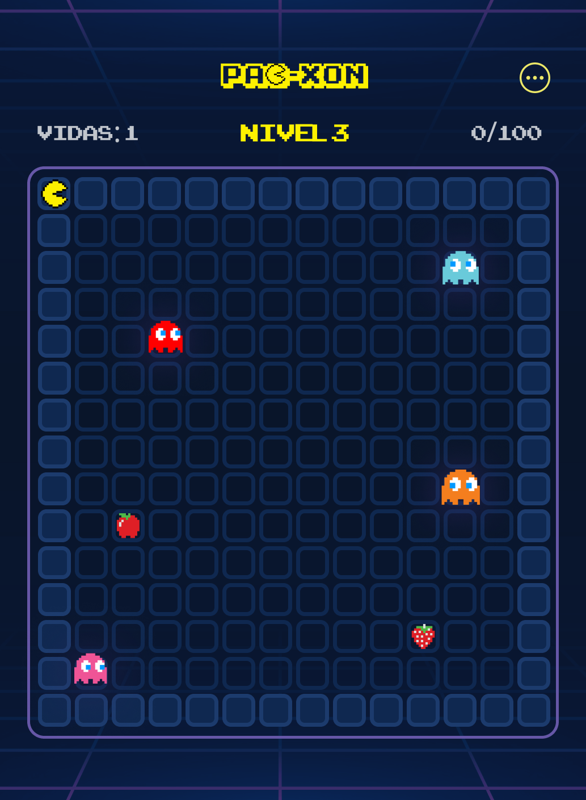
**Fig 7.** Nível 3

**Fig 8.** Simulação de Colisão

 
**Fig 9.** Ecrã em caso de Game Over

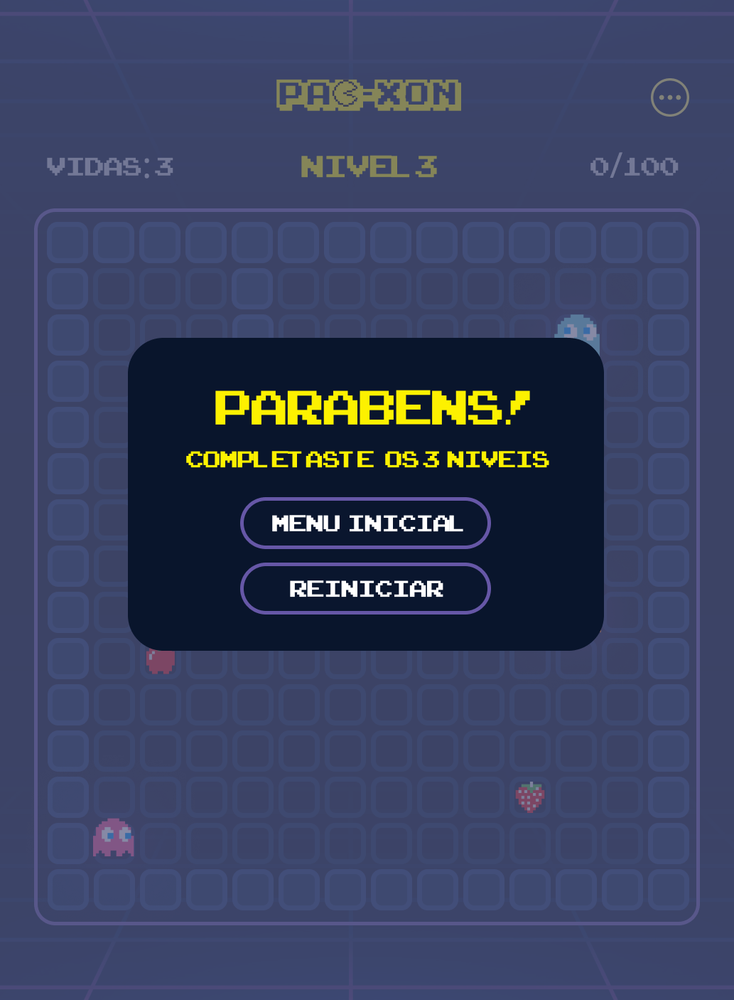   
**Fig 10.** Ecrã em caso de Win

### SCREENSHOTS

Os seguintes screenshots foram tirados durante o desenvolvimento do projeto e têm como objetivo mostrar o resultado final do design do jogo:

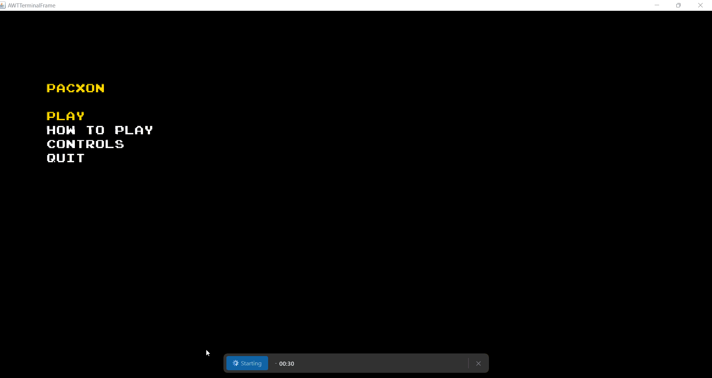
**Fig 11.** Sneak Peak de alguns menus e do primeiro mapa

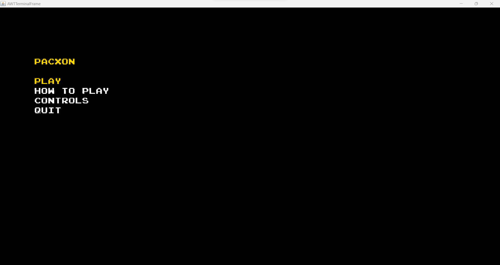
**Fig 11.** Menu Inicial

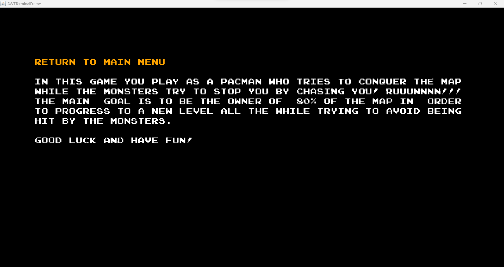
**Fig 12.** Como Jogar

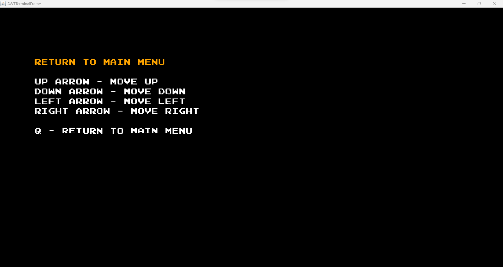
**Fig 13.** Controlos

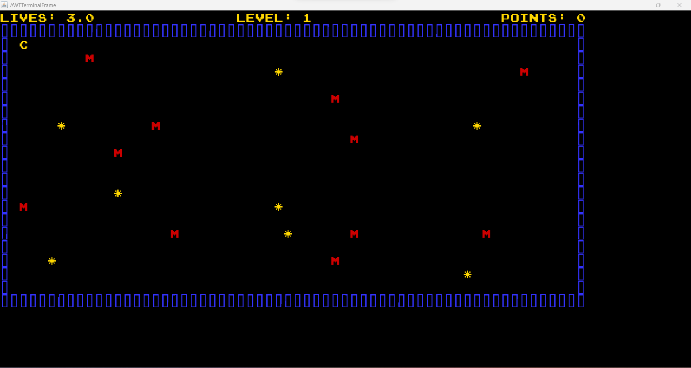
**Fig 14.** Nível 1

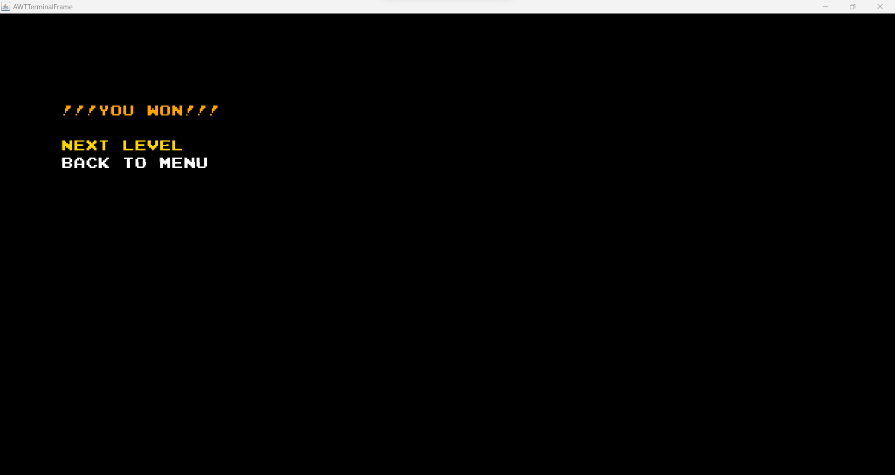
**Fig 15.** Ecrã em caso de ganhar o nível 1

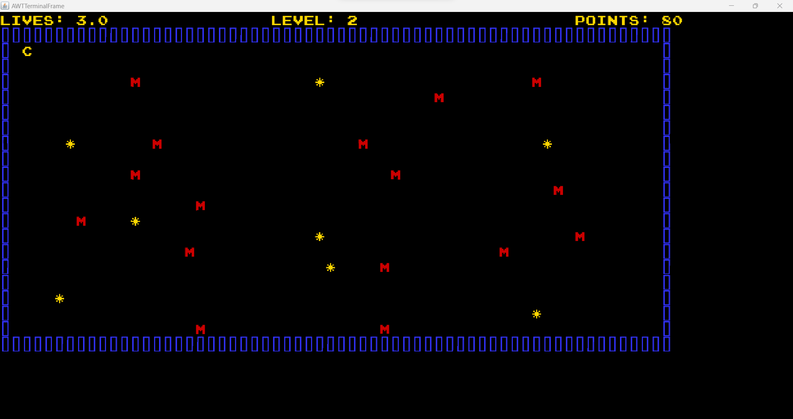
**Fig 16.** Nível 2

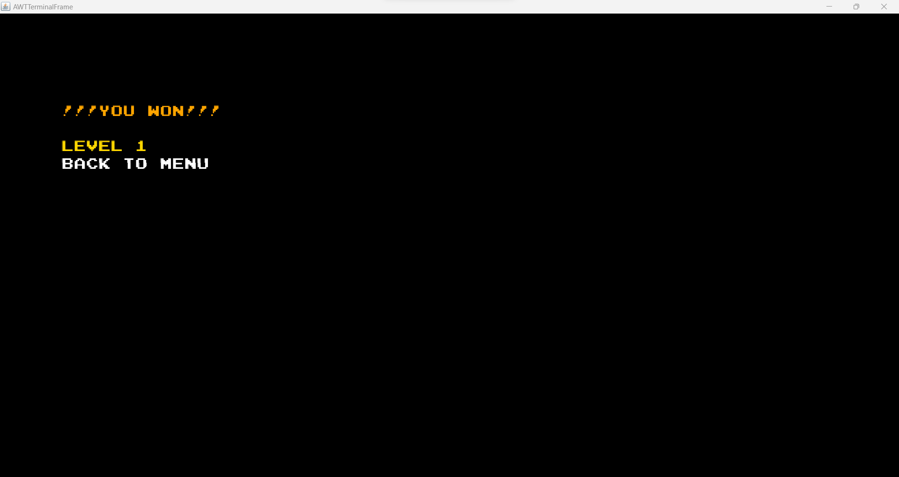
**Fig 17.** Ecrã em caso de ganhar o jogo

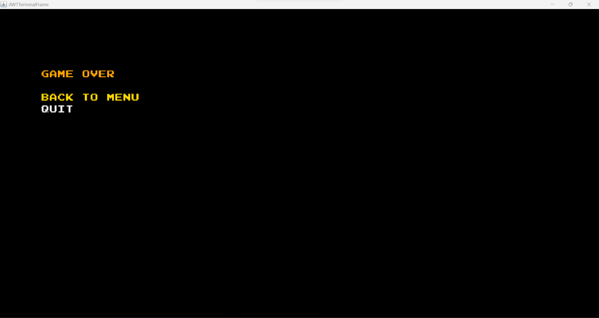
**Fig 18.** Ecrã em caso de perder o jogo

### SELF-EVALUATION
A divisão de trabalho foi feita através de acordos mútuos e todos os elementos participaram na execução do projeto equitativamente.
- Beatriz Pereira: 33%
- Francisca Fernandes: 33%
- Francisco Lopes: 33%
