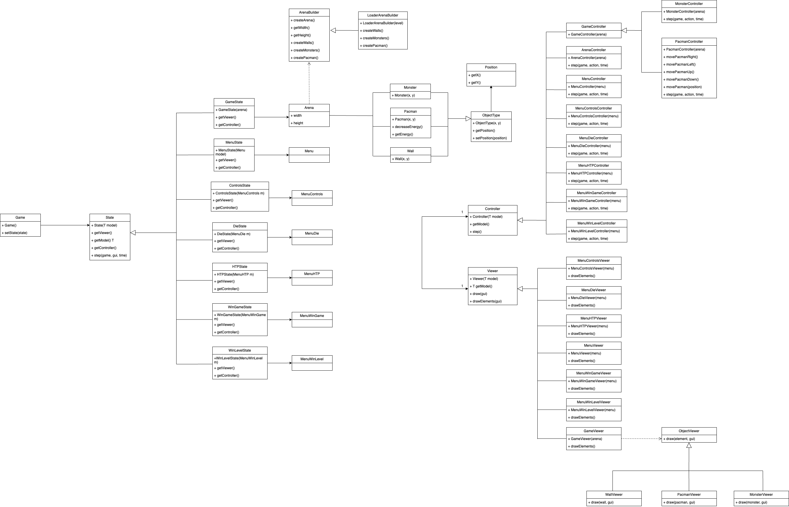
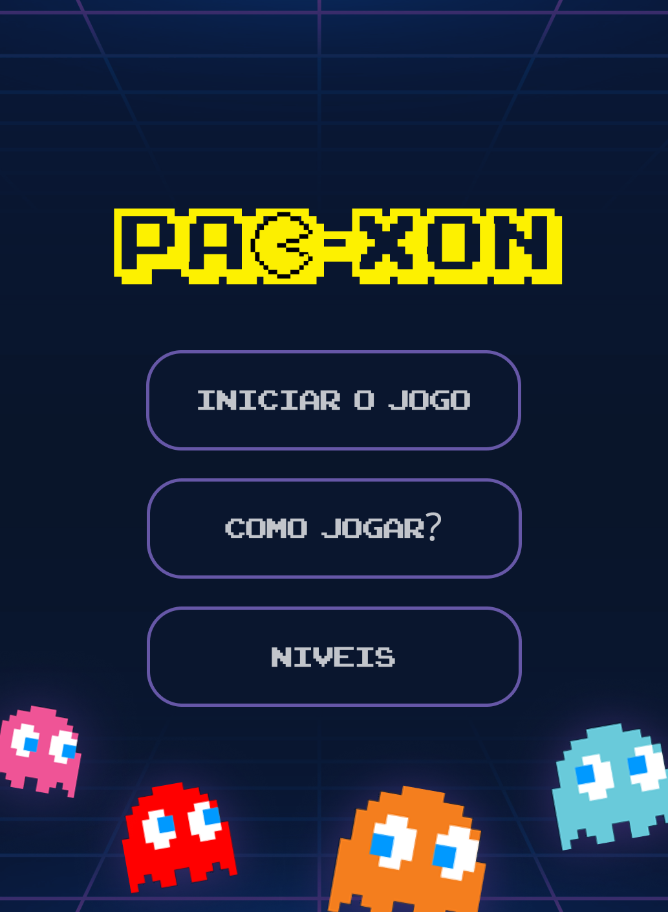
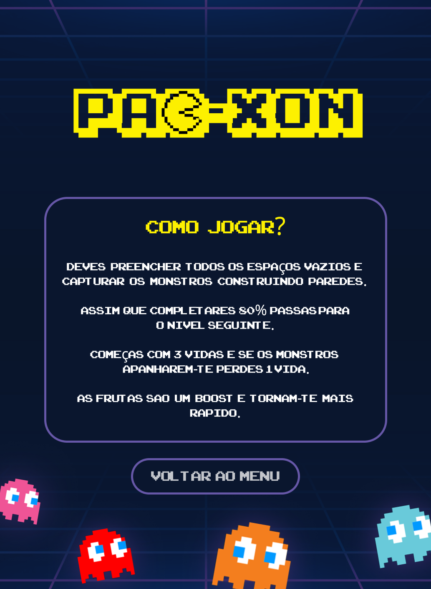
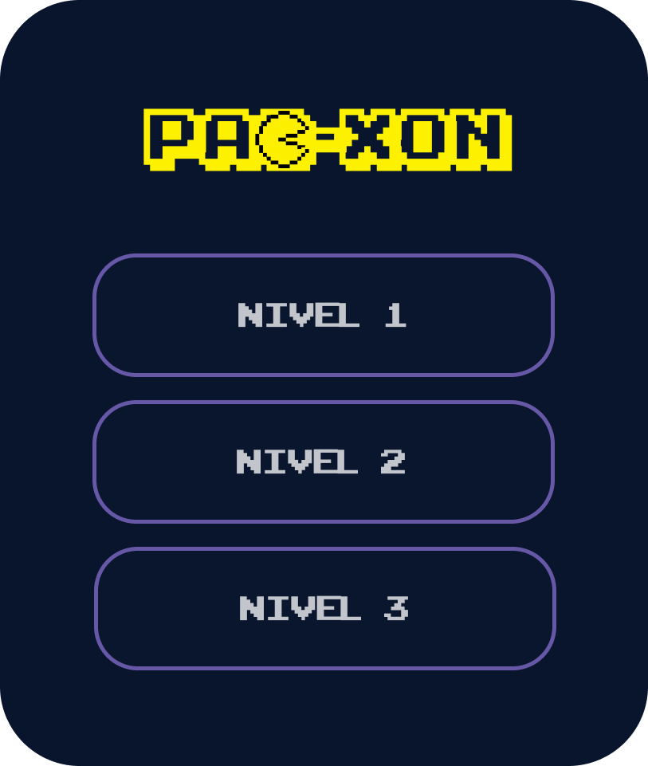
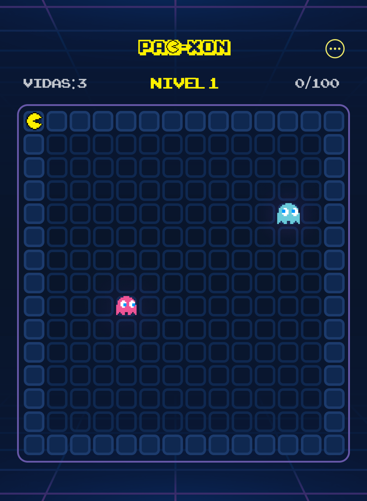
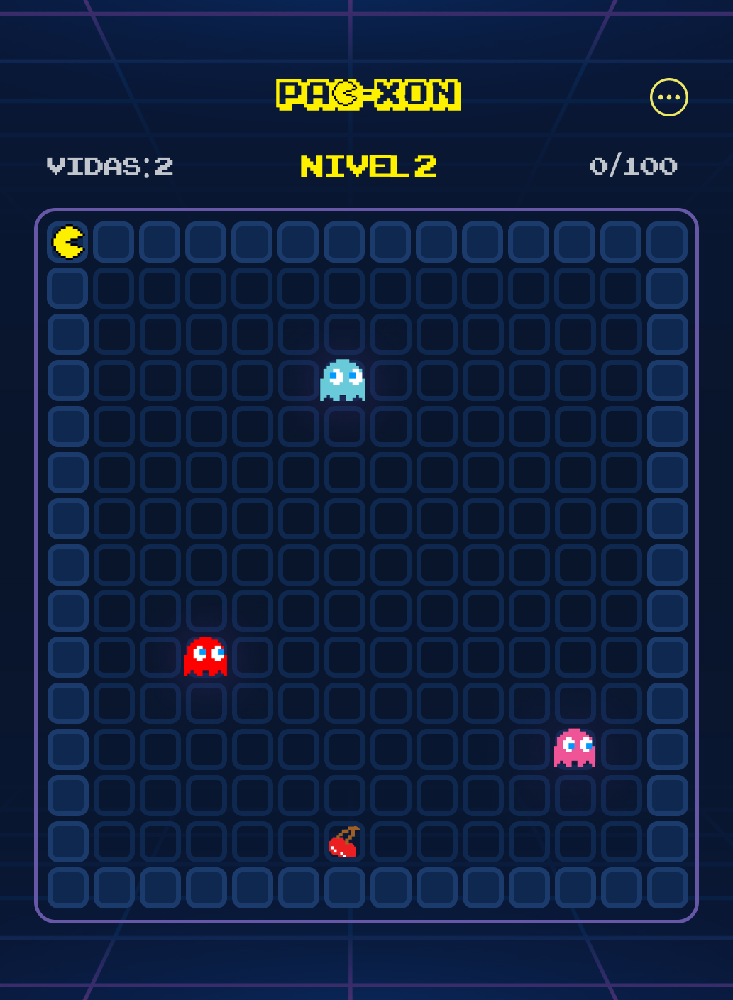
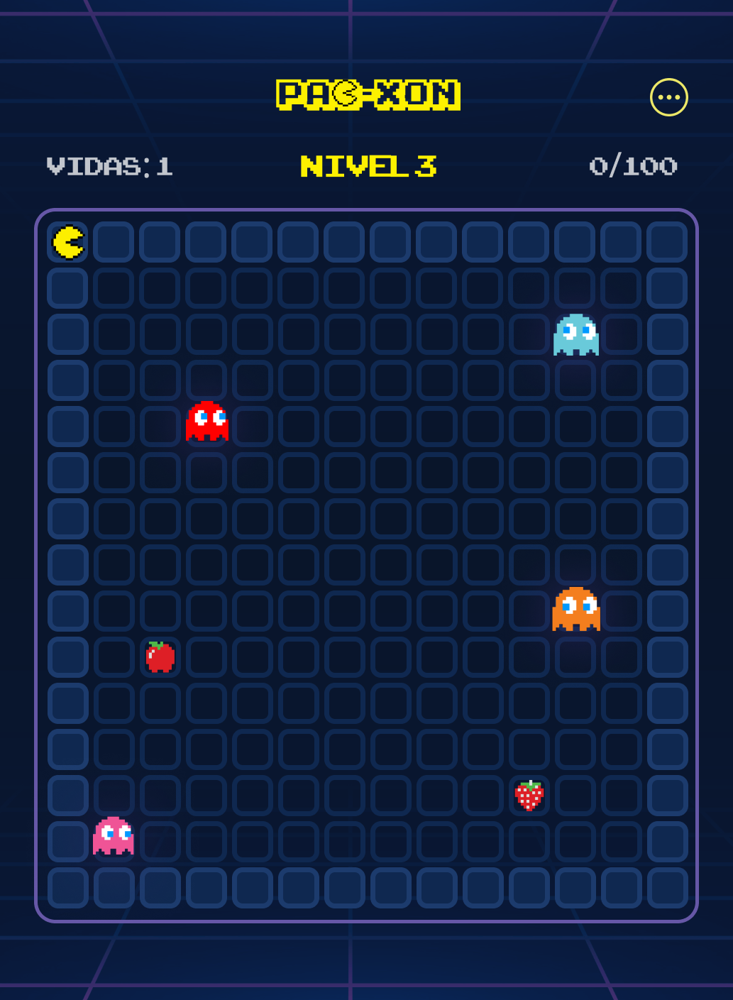
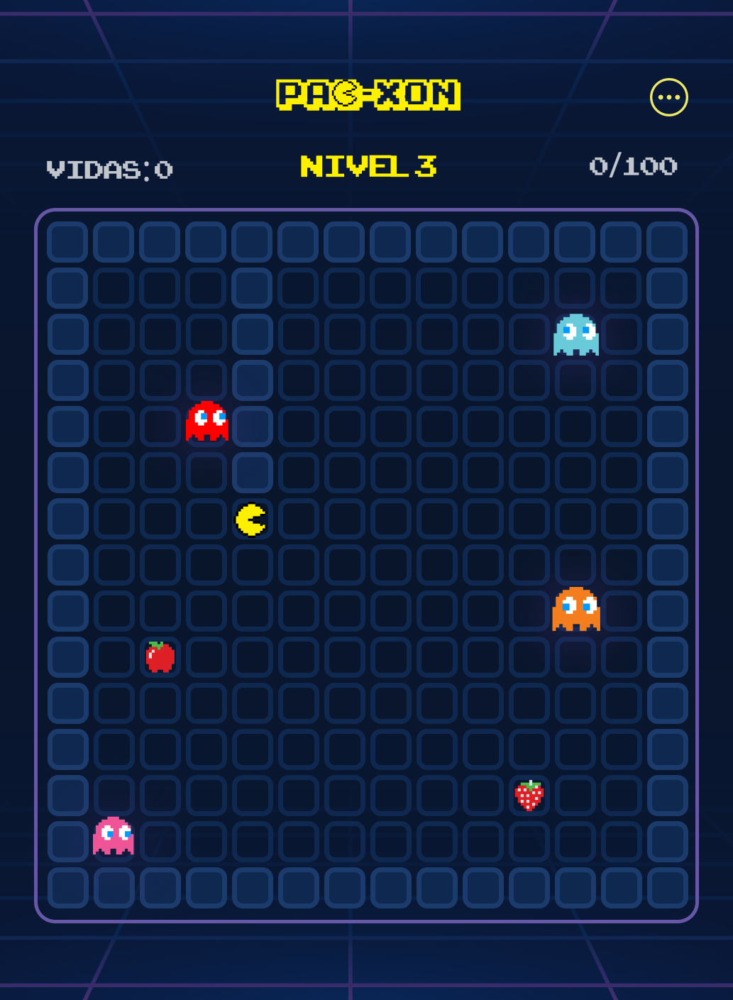
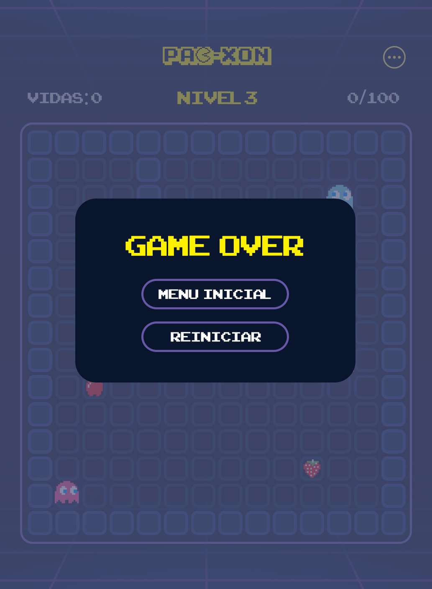
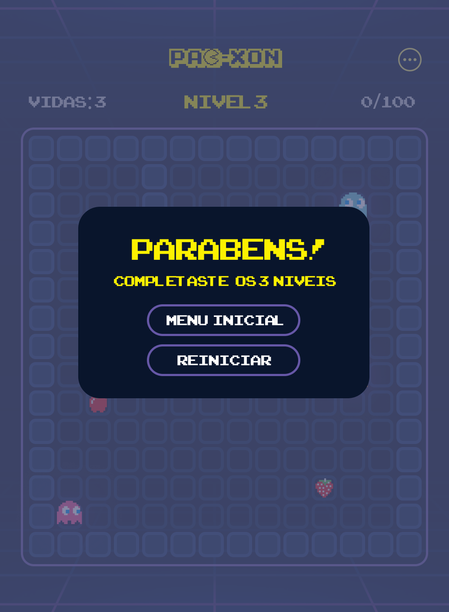

## LDTS_T05G05 - PACXON

O "Pacxon" consiste na junção de dois jogos: PacMan e Xonix. O objetivo principal do jogo é preencher os espaços vazios e capturar os monstros construindo paredes à volta deles. O utilizador passa para o nível seguinte assim que preencher 80% do mapa. À medida que avança de nível a dificuldade aumenta.

Autores: Beatriz Pereira (up202207380), Francisca Fernandes (up202106509) e Francisco Lopes (up202108796) para LDTS 2023/24

### IMPLEMENTED FEATURES

- Menu: Oferece as funcionalidades de iniciar o jogo, ver como jogar, ver as regras e sair;
- Movimento do PacMan: O utilizador consegue movimentar o PacMan através das teclas convencionais do seu computador;
- Movimento dos Monstros: Os Monstros movimentam-se automaticamente, de forma aleatória;
- Colisão entre o PacMan e os Monstros: Quando o PacMan e os Monstros colidem, o PacMan perde uma vida e tem de recomeçar o nível em que se encontra. Caso seja a sua última vida, perde o jogo;

### PLANNED FEATURES
- Menu: pausá-lo, reiniciar, retomar e selecionar o nível do jogo;
- Introdução de monstros novos à medida que avança de nível;
- Música de fundo e sons do jogo (colisão com um monstro, captura de um boost, etc.);
- Boosts do PacMan: elementos que aparecem aleatoriamente em cada nível e que, assim que o PacMan os alcance, melhoram a sua performance (aumentam a sua velocidade, congelam os Monstros, atribuem vidas extra, etc.);
- Preenchimento dos blocos: O caminho que o PacMan percorre vai preenchendo os blocos do mapa desde que não colida com nenhum monstro.

### DESIGN

- **Problem in Context.** Durante o desenvolvimento do Pacxon, deparámo-nos com o desafio de gerir diferentes estados do jogo, tais como o menu, a jogabilidade e as situações de fim de nível.
- **The Pattern.** Para solucionar isso, decidimos implementar o pattern de design State. Este pattern é ideal para cenários onde o comportamento de um objeto muda com base no seu estado interno. Ao encapsular os comportamentos específicos de cada estado em classes separadas, conseguimos simplificar as transições e interações entre os diferentes estados do jogo.
- **Implementation.** Criámos classes base abstratas para cada estado, como MenuState e GameState e implementámos os comportamentos específicos nas suas subclasses respectivas. Esta estrutura facilitou a mudança entre estados e tornou o código mais modular e legível.

**Classes:**
- [MenuState](https://github.com/FEUP-LDTS-2023/project-l05gr05/blob/main/src/main/java/com/aor/pacxon/states/MenuState.java)
- [GameState](https://github.com/FEUP-LDTS-2023/project-l05gr05/blob/main/src/main/java/com/aor/pacxon/states/GameState.java)

**Consequences:** 

A aplicação do padrão State melhorou significativamente a manutenção e escalabilidade do jogo Pacxon. Cada estado do jogo pode agora ser modificado independentemente sem afetar os outros, facilitando futuros aprimoramentos e correções de bugs. No entanto, esta abordagem introduziu classes adicionais, o que aumentou ligeiramente a complexidade da base de código. Apesar disso, os benefícios de uma maior modularidade e adesão aos princípios de design superaram as desvantagens.

### UML

**Fig 1.** Modelo UML do Projeto

### MOCKUPS 

Os seguintes mockups foram desenvolvidos recorrendo à plataforma "Figma" e têm como objetivo esboçar o resultado do design final pretendido pelo grupo.

 
**Fig 2.** Menu Inicial 

**Fig 3.** Como Jogar

  
**Fig 4.** Menu Níveis

 
**Fig 5.** Nível 1

**Fig 6.** Nível 2

**Fig 7.** Nível 3

**Fig 8.** Simulação de Colisão

 
**Fig 9.** Ecrã em caso de Game Over

   
**Fig 10.** Ecrã em caso de Win

### SELF-EVALUATION

- Beatriz Pereira: 33%
- Francisca Fernandes: 33%
- Francisco Lopes: 33%
